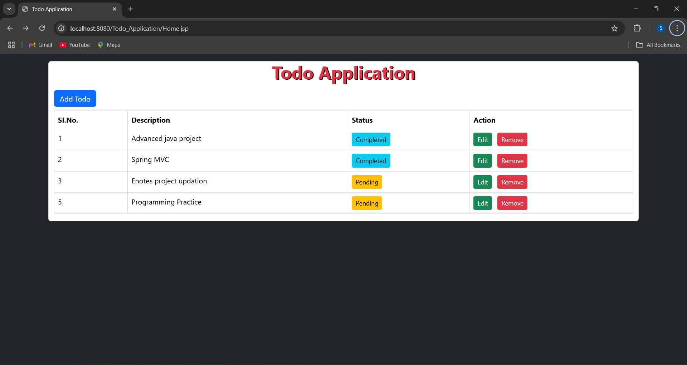
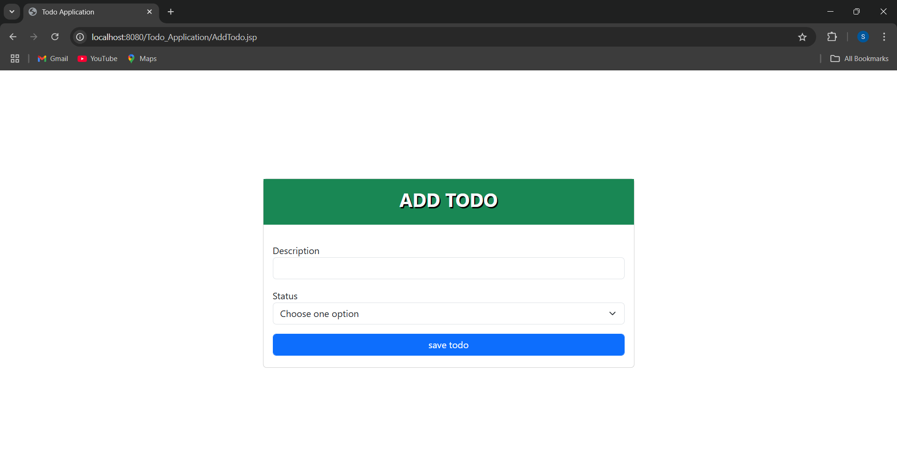
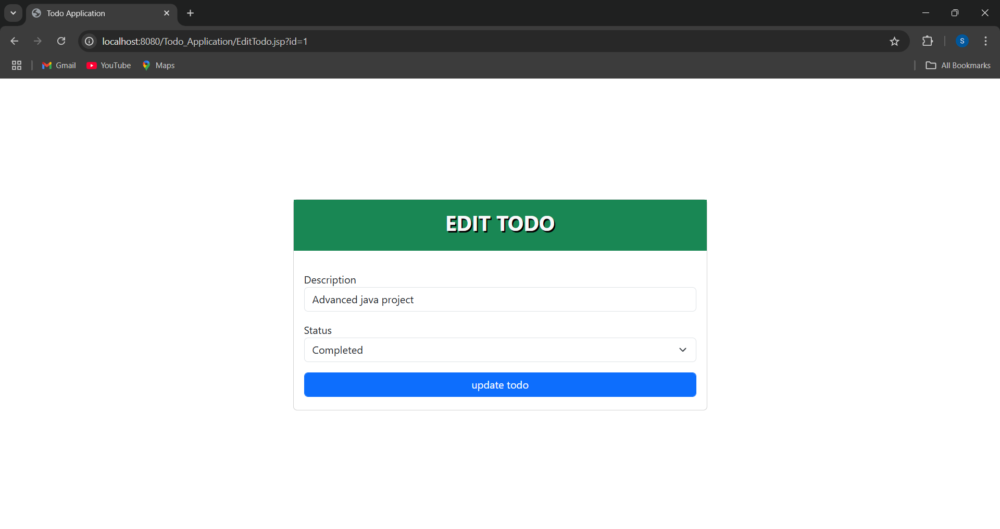
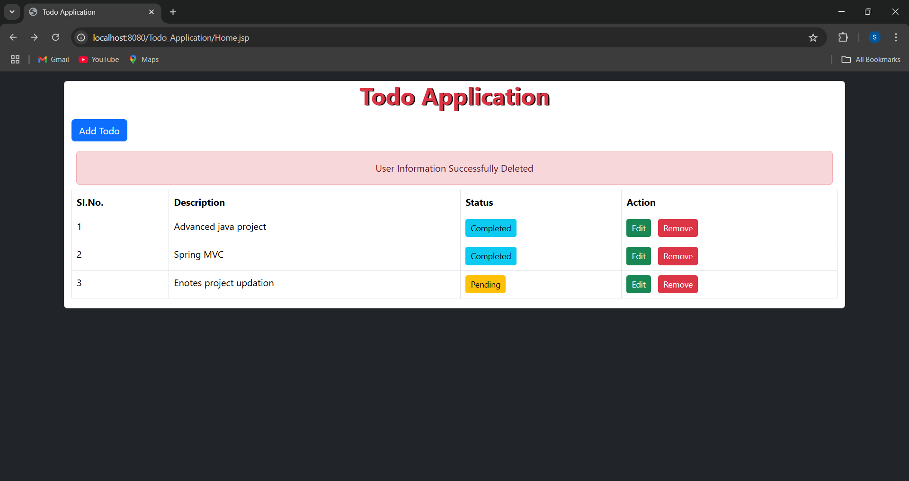

<h2 align="center">TODO APPLICATION</h2>
This project is developed by using jdbc, servlets, jsp, bootstrap and mysql database. It will operations such as:
<ul>
  <li>Add Todo</li>
  <li>Edit Todo</li>
  <li>Remove Todo</li>
  <li>View Todos</li>
</ul>
<h3 align="center">Screenshots</h3>

 

 

 

